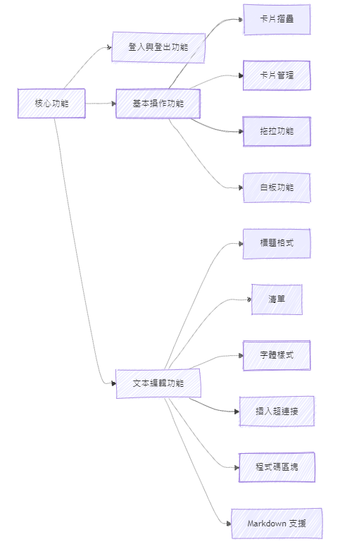

# **HappyNotes** 專案提案

## 1. 專案主題

HappyNotes 是一款不同於其他筆記軟體的應用。相比傳統線性模式或資料夾管理方式，HappyNotes 以卡片和白板的設計為核心，用戶可將學習內容拆解為不同的知識卡片，並將這些卡片攤開在一個版面上，且可以互相連結，激發更多的創意。這種知識管理方式方便直觀，目標是設計一款核心功能免費的筆記軟體，功能上類似 Heptabase，但對所有人開放免費使用。

---

## 2. 功能需求

### 第一步核心功能

1. **卡片操作功能**
    - **卡片摺疊**：將卡片內容折疊以節省空間。
    - **全螢幕顯示**：支援卡片全螢幕顯示。
    - **卡片尺寸調整**：根據內容自動調整卡片大小。
    - **側邊欄顯示**：將卡片添加到側邊欄方便瀏覽。
    - **複製/刪除**：可複製或刪除卡片。
    - **移動功能**：卡片可以移動到其他文件或分組。
2. **文本編輯功能**
    - **標題格式**：支持多層級標題格式 (Heading 1, 2, 3)。
    - **清單樣式**：支持任務清單、項目符號清單、編號清單等。
    - **字體樣式**：支持字體加粗、斜體、下劃線等樣式。
    - **插入超連結**：可以插入外部超連結。
    - **程式碼區塊**：支援插入程式碼區塊。
    - **Markdown 支援**：支援 Markdown 語法。
    

以上是第一步的核心功能，我們想先把基礎功能做好再做登入登出功能。

功能的完整性: 

第一步: 基本卡片操作和文本編輯功能。

第二步: 登入登出功能和管理卡片功能。

第三步: 處理不同卡片的連結、標籤功能，管理標籤。

第四步: PDF 匯入功能、PDF 匯出功能。

當然還有更多進階功能，像是 離線編輯、卡片版本控管、卡片共編 等等，但我們想先一步一步挑戰。

或是思考到**技術的擴展性**，像是網路流量或是性能優化，網路流量的部分可以考慮使用 Nginx 來負載平衡，避免單點壓力過大。
除此之外，因為我們使用 MongoDB，可以使用分片技術減輕單一資料庫負荷。

---

## 3. 技術選型
- **前端建立工具**：Vite
- **前端 UI 工具**：[shadcn/ui](https://ui.shadcn.com/)
- **前端技術**：HTML、CSS、JavaScript、React
- **後端技術**：Node.js、Express、Nginx
- **資料庫**：MongoDB（大家想嘗試看看）


選擇 MongoDB 是因為適合儲存半結構化資料，如卡片筆記，並能靈活處理卡片與主題之間的關聯。
它有不錯的可擴展性和 JSON 格式，適合大資料量和多層結構的需求。
雖然我們也沒有學過 MongoDB，以前只有學過 MySQL 關聯式資料庫，所以這次專案是好機會。

其他技術像是 React 以前只有稍微碰過，但是對於一些原理不熟，不知道 React 渲染網頁的原理，
還有其他像是 hook 、 usestate 等等機制也不熟，希望利用這次專案的機會更了解一些工具使用。


---

## 4. 架構設計

核心功能架構設計如以下示意圖所示：




---

## 5. Git Branching Model

我們決定採用以下分支模式：

- **主要分支**：`main` (穩定版本)，`develop` (開發中功能)
- **功能分支**：從 `develop` 開分支開發新功能，完成後合併回 `develop`。
- **發佈分支**：從 `develop` 開分支，準備新版本的發佈。
- **修補分支**：從 `main` 開分支用於緊急修復，修復後合併至 `main` 和 `develop`。

開發時先 main，develop，feature 三個分支為主

## 6. Merge 還是 Rebase? 

經討論後，我們決定使用 **Merge**。

---

## 7. Trello 進行專案管理

[Trello 連結] (https://trello.com/b/XunnpApb/cloud-group-7)

我們將 Trello 看板分為以下幾個部分：

- **Backlog**：儲存討論中的功能。
- **Blockby**：開發過程遇到阻礙時將任務移至此處。
- **To Do**：即將進行的任務。
- **Doing**：開發中的任務。
- **Code Review**：檢查程式碼。
- **To deploy**：準備部署至生產環境的任務。
- **Deployed**：已部署至生產環境的任務。

---

## 8. 作業標準討論

結論: 我們決定採用 **業界面試標準**，挑戰自我。

---

## 9. 投影片和報告分工

結論: 之後會交給負責該任務的人講解。

### 報告安排：

- 2024/10/17 小組報告：睿廷
- 2024/11/14 小組報告
- 2024/11/28 小組報告
- 2024/12/12 小組報告
- 2024/12/19 小組報告
- 2025/1/2 期末報告預演
- 2024/1/9 期末報告

---

## 10. 專案分工

下面列出是主要負責任務，但前後端可互相幫忙。

### 前端（UI/UX 設計 + 開發）

- 智鈞

### 後端 + 資料庫

- 睿廷
- 鎮成
- 廷翔


## 11. 團隊共識
<details>
  <summary>團隊共識</summary>

   ### 1. 技術選型
  - **前端建立工具**：Vite
  - **前端 UI 工具**：[shadcn/ui](https://ui.shadcn.com/)
  - **前端技術**：HTML、CSS、JavaScript、React
  -   **後端技術**：Node.js、Express、Nginx
-   **資料庫**：MongoDB（大家想嘗試看看）


  ### 2. 決定 repo 是其他人 fork 出去

  ### 3. 統一使用 merge 合併

  ### 4. Git Branching Model

我們決定採用以下分支模式：

  主要分支：main (穩定版本)，develop (開發中功能)

  功能分支：從 develop 開分支開發新功能，完成後合併回 develop。

  發佈分支：從 develop 開分支，準備新版本的發佈。

  修補分支：從 main 開分支用於緊急修復，修復後合併至 main 和 develop。
  
  開發時先 main，develop，feature 三個分支為主 


### 5. Commit 規範
  
- `feat`: 新功能
- `fix`: 修補 bug
- `refactor`: 重構，不涉及功能或 bug 修正
- `build`: 更改建置系統或外部依賴
- `chore`: 依賴更新，無關 src 或 test 文件修改
- `perf`: 改善效能
- `test`: 新增/更新測試
- `revert`: 還原先前的 commit
- `docs`: 文件更新
- `style`: 程式碼格式修正（如移除空白、調整縮排）

### 6. Coding Style

  ### 1. 縮排與行長

- **縮排**：使用 4 個空格。
- **行長**：保持每行 80 到 100 個字元。

### 2. 變數命名

- 使用駝峰命名法（camelCase），變數名稱應具語義。

```jsx
let totalCost = 0;
function calculateTotal() { /* ... */ }
```

### 3. 常數命名

- 使用大寫字母和底線命名常數。

```jsx
const MAX_LIMIT = 100;

```

### 4. 使用嚴格模式

- 在程式開頭使用 `"use strict";`。

```jsx
"use strict";

```

### 5. 使用 `const` 和 `let` 代替 `var`

- **const** 用於不可變變數，**let** 用於區域變數。

```jsx
const PI = 3.14;
let count = 0;

```

### 6. 分號

- 每行結尾都應加上分號。

```jsx
let x = 5;
let y = 10;

```

### 7. 函式定義

- 儘量使用箭頭函式 (arrow functions)，保持函式小而精簡。

```jsx
const add = (a, b) => a + b;

```

### 8. 陣列與物件

- 使用物件和陣列字面量定義。

```jsx
const person = {
  name: 'John',
  age: 30,
  city: 'New York'
};

const numbers = [1, 2, 3, 4, 5];

```

### 9. 條件判斷

- 使用嚴格相等符號 (`===`)。

```jsx
if (a === b) { /* ... */ }

```

### 10. 字串處理

- 儘量使用模板字串（Template Literals）。

```jsx
const name = 'Alice';
console.log(`Hello, ${name}!`);

```

### 11. 解構賦值

- 使用解構賦值提取物件或陣列的值。

```jsx
const { name, age } = person;
const [first, second] = numbers;

```

### 12. 註解

- 善用單行註解和多行註解來說明程式邏輯。

```jsx
// 單行註解
/* 多行註解 */

```

### 13. 避免巢狀過深

- 將過度巢狀的程式碼抽取為小函式，提升可讀性。

### 14. 錯誤處理

- 使用 `try/catch` 進行錯誤處理，避免崩潰。

```jsx
try {
  // 程式碼
} catch (error) {
  console.error(error);
}

```

  
</details>

## 12. 開會遇到的困難

1. 像是討論 coding style 、 branch model 、 trello 專案管理，大家以前課程都沒有要求過，也沒有嘗試過，
所以不知道實務上如何運作，有些事情可能要試過，才知道如何調整，但我們覺得是個很好讓自己成長的機會，不會才代表我們的成長空間還很多。
